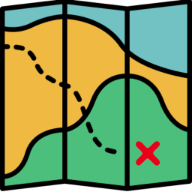
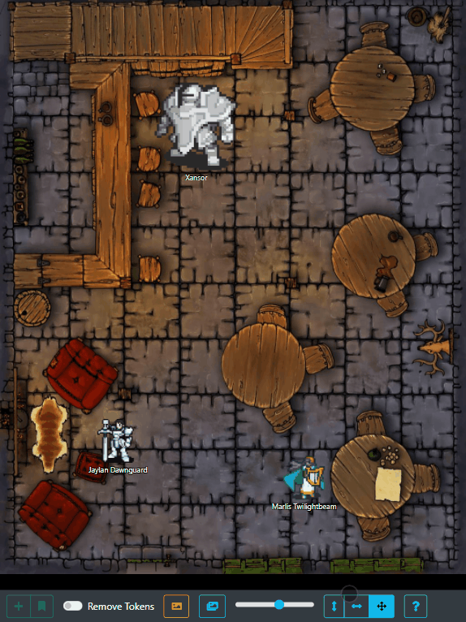
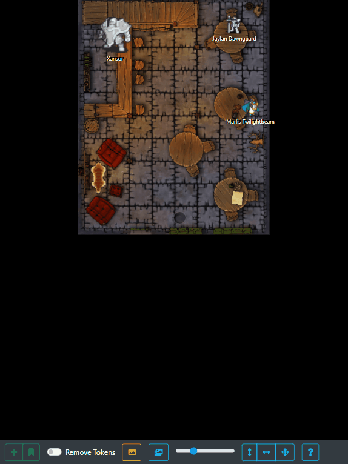
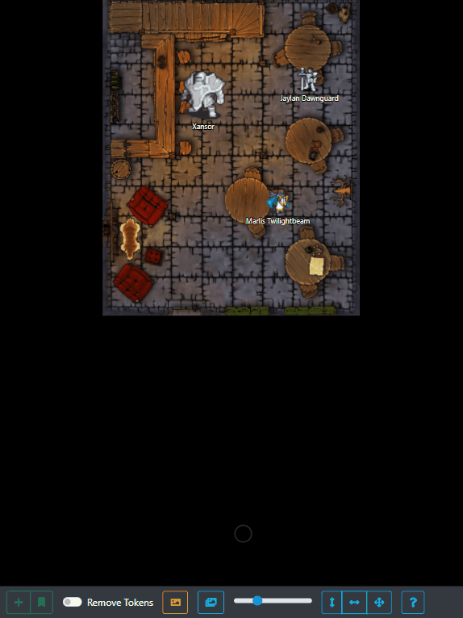

# Tabletop Explorer

Welcome to Tabletop Explorer. A simple, game-agnostic tabletop map simulator.
Optimised for Desktop and Tablets (mobile coming soon). Everything is stored in
your browser, no internet connection needed, no servers to connect to, no 
accounts to create.

## Features

*Show off your carefully designed maps in all their glorious detail. You'll be
able to effortlessly tell your characters exactly how far away their next fight
is.*

*Quickly add any number of tokens to the map, saving your PC's tokens so you 
don't waste any time getting them into their next deadly encounter.*

*There's no limits to the places your characters can go, and no limits to the 
number of maps you can have. Switch back and forth with ease.*

*Painlessly set the scale of your map so you know your tokens will fit 
perfectly.*

*Show off your maps to your players with nothing more than a link to share with
 them. No accounts needed.** 

*Internet Connection Required

## How To Run

Serve over ice using your preferred static content provider (Apache, Nginx, etc.).

## Endpoints

- `GET /` - Main page
- `GET /static` - Static resources (css, js, etc.)
- `GET /viewer/{id}/{key}` - Read-only viewing page
- `POST /share` - returns a unique endpoint `id` to start sharing from and a 
write `key` for the leader.
- `HEAD /share/{id}/resource/{hash}` - Returns 200 if a resource has 
already been uploaded, otherwise 404
- `POST /share/{id}/resource/{hash}` - Upload a resource for the share
- `GET /share/{id}/resource/{hash}` - Gets a resource for the share
- `SSE /share/{id}/` - subscribe to the share. 
- `POST /share/{id}/update` - Messages accompanied by the 
write `key` will be broadcast to all subscribers, otherwise ignored.

_N.B. It's up to the client to create an encryption key and share it with viewers._

## Credits

- Logo designed at [LogoMakr.com](https://logomakr.com/)
- [Tavern map reproduced from 'Dungeons and Dragons - Tiled Tavern Map' by 'Mike-Perrotta'](https://www.deviantart.com/mike-perrotta/art/Dungeons-and-Dragons-Tiled-Tavern-Map-584588937)
- [List of Dungeons & Dragons 5th edition monsters](https://dungeonsdragons.fandom.com/wiki/List_of_Dungeons_%26_Dragons_5th_edition_monsters)
- [Tokens reproduced from 'Human and human-shaped characters'](https://imgur.com/a/iOCnr#0)
- [Boat map reproduced from 'Lair Assault Map Gallery' on dungeonsmaster.com](http://dungeonsmaster.com/2012/10/lair-assault-map-gallery/)